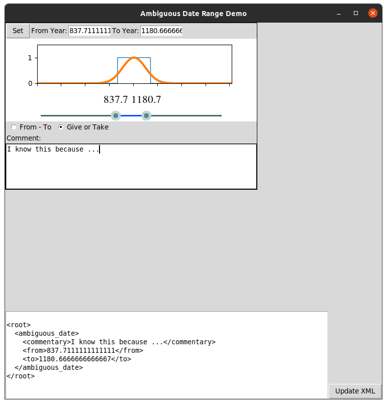

Demo demonstrating a UI that can accomadate scholars in entering ambiguous dates.




Installing with pip:
```bash
pip install git+https://github.com/anguelos/ambiguous_dates.git
```

Downloading with git and running without instalation:
```bash
git clone git@github.com:anguelos/ambiguous_dates.git
cd ambiguous_dates
PYTHONPATH="./" ./bin/probable_date_demo
```
